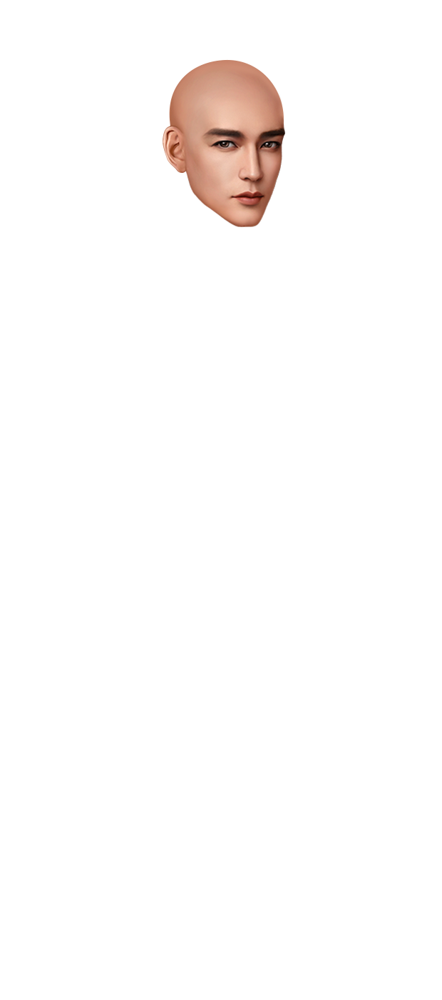
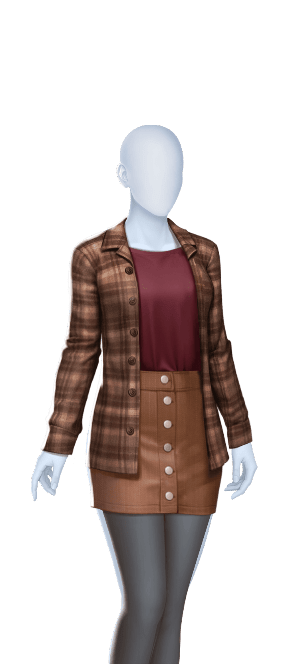
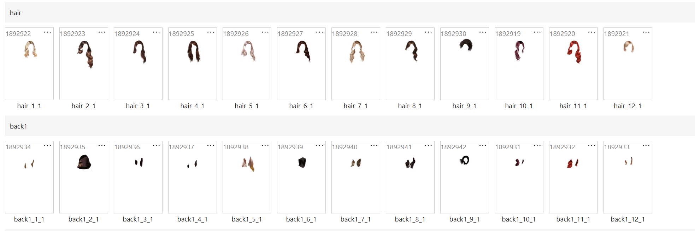

# 新cc库\-基础搭建

# 版本信息

|**时间**|**版本号**|**变更人**|**主要变更内容**|
|---|---|---|---|
|2026/7/20|1\.0\.0|蒋锦鹏|创建文档|

# 需求背景

替换dropbox线上资源库，建立一个只存在适配资源的新cc库，由三方共同维护，提高沟通效率，降低配置成本。

# 需求概述

- 资源库架构搭建

- 标签管理

- 资源内容说明

- 批量打标

- 资源搜索

- 收藏功能

- 角色管理

- 角色创建

- 打包规则

- 预览器规则

# 需求说明

以下全部功能需求的字段文本描写，都需要能切换中英版本进行操作

原型html:

[asset\-manager\-prototype\_4\.html](图片和附件/asset-manager-prototype_4.html)

不同资源页签在不进行大切换时，不销毁，资源列表和选中状态等界面不改变

### 界面说明

|位置|原型图|说明|
|---|---|---|
|新资源库入口||1. 资源管理     1. 用于查找与存储角色资源的界面 2. 音频管理     1. 用于查找与存储音频资源的界面 3. 物件管理     1. 用于查找与存储物件资源的界面 4. 背景管理     1. 用于查找与存储背景资源的界面 5. 角色管理     1. 角色包展示区域，并且支持挑选资源达成角色包体下发给pgc业务库 6. 标签管理     1. 用于管理分类标签 |
|资源管理| |1. 页签划分     1. 角色         1. 体型         2. 头部         3. 发型         4. 衣服         5. 饰品             1. 眼镜             2. 耳环             3. 帽子             4. 围巾             5. 项链             6. 手链             7. 手臂             8. 戒指             9. 包             10. 翅膀             11. 纹身     2. 背景     3. 音效         1. 音效         2. 音乐     4. 物件 2. 角色展示     1. 用于展示选中资源叠加后的表现形式     2. 执行表情切换 3. 标签筛选     1. 划分两个部分         1. 核心标签区         2. 分类标签区     2. 用于筛选过滤底部资源，用于快速区分想找的资源类型     3. 支持收起和展开两种模式 4. 收藏入口     1. 点击可进入收藏界面，查看自己收藏的资源 5. 导入资源入口     1. 点击后打开弹窗，上传对应资源 6. 排序规则     1. 目前只支持两种排序方式         1. 上新：按照资源更新从新到旧排序         2. 收藏量：按照资源收藏量从多到少排序 7. 批量修改入口     1. 点击后支持批量选择修改 8. 资源展示区     1. 展示对应分类下的资源|
|音频资源模块||1. 音频界面无核心标签下拉框，只通过分类进行筛选区分 2. 资源已卡片形式展示，可进行播放     1. 播放途中可拖拉进度条，允许中途暂停     2. 一次只能播放一个资源的音频，互相切换则重新开始播放|
|物件管理，背景管理|||

### 标签筛选

- 角色资源需要遵守核心标签的规则，方便资源的划分

**目前固定的核心标签如下**

- 性别：男，女

- 体型：衰老，微胖，瘦弱，标准

- 年龄：成年，少年，婴儿，小孩

- 肤色：黄，拉丁，白，黑

- 是否付费：付费，免费

- 在不同角色资源界面下，核心标签可支持用于分类划分，但不同的资源类型对应的核心标签表现不一致，具体入下表规则

**左边核心标签说明**

|分类|展示核心标签|说明|
|---|---|---|
|角色\-身体 |性别：男，女 体型：衰老，微胖，瘦弱，标准 年龄：成年，少年，婴儿，小孩 肤色：黄，拉丁，白，黑|身体无需付费资源类型描述 |
|角色\-头部|性别：男，女 体型：衰老，微胖，瘦弱，标准 年龄：成年，少年，婴儿，小孩 肤色：黄，拉丁，白，黑 是否付费：付费，免费|全核心标签展示 |
|角色\-发型|性别：男，女 体型：衰老，微胖，瘦弱，标准 年龄：成年，少年，婴儿，小孩 是否付费：付费，免费|除去肤色核心标签 |
|角色\-衣服|性别：男，女 体型：衰老，微胖，瘦弱，标准 年龄：成年，少年，婴儿，小孩 是否付费：付费，免费|除去肤色核心标签|
|角色\-饰品 |性别：男，女 体型：衰老，微胖，瘦弱，标准 年龄：成年，少年，婴儿，小孩 是否付费：付费，免费|除去肤色核心标签 |
|背景|特殊核心标签 室内外：室内，室外 时间：白天，夜晚，黄昏，黎明| 特殊核心标签 |
|bgm|无|无核心标签|
|音效|无|无核心标签|
|物件|无|无核心标签|

|位置|原型图|说明|
|---|---|---|
|标签展开|  |1. **顶部核心标签**     1. 标签说明         1. 性别：单选             1. 默认all         2. 体型：单选             1. 默认all         3. 肤色：单选             1. 默认all         4. 年龄：单选             1. 默认all         5. 是否付费：单选             1. 默认all     2. 当下拉框为all时，则对应核心标签不参与筛选，默认全选     3. 当下拉框选中对应分类时，需要资源包含对应标签，否则过滤     4. 重置         1. 重置全部标签（核心和普通分类标签）     5. 核心标签选中后，切换不同分类不会重置标签 2. 大分类（按照当前顺序展示）     1. 身体     2. 脸部     3. 发型     4. 衣服     5. 饰品 3. **分类标签说明**     1. 初始化无默认标签     2. 当分类小于等于三个时，则固定展示不支持滚动，当大于等于三个分类时，可滚动展示更多的tag     3. 当单父级分类的子标签达到当前区域的宽度时，动态换行      4. 支持**快捷添加小分类**     5. 可展开选择，当点击右下角的展开ui时，则扩大选择界面  4. 用户可通过点击标签最后方的添加按钮，打开快捷创建弹窗,实现当场添加与分类 5. **标签的每次变动都会改变底部搜索结果，动态筛选资源**** 给一个默认的搜索转菊**  6. 搜索逻辑     1. 核心标签：核心标签搜索都是且，需要同时存在的资源才会展示     2. 分类标签：分类标签同级可支持多选，多选搜索效果是“或”逻辑，不同分类之间搜索则为“且”逻辑 7. 标签筛选通过tag形式展示在底部,并且需要支持删除     1. 并且搜索关系会用“且，或”展示出来  |
|标签添加弹窗||1. 父级标签展示当前大分类 2. 需要补充英文名和中文名，都**必填** 3. 确认时，需要校验内容是否已存在过，不可重复，重复弹出报错提示 |

### 标签管理

标签管理界面重构

|位置|原型图|说明|
|---|---|---|
|标签管理入口|||
|标签管理界面 |    |1. 分类\-下拉框     1. 通过分类下拉框，筛选出对应分类下挂载的标签 2. 列表字段     1. id\-父级标签id     2. 名称\-当前父级标签名称，固定格式：中文名/英文名     3. 操作         1. 删除             1. 需要当前父级标签不再存在子级才可进行删除，不满足时点击弹出提示（二级弹窗确认）         2. 修改             1. 点击打开修改弹窗（同新增弹窗一致）     4. 可拖拽调整父级展示的顺序 3. 父级列表支持展开查看子级     1. 子级展示内容：         1. 子级名称，固定格式：中文名/英文名         2. 被使用次数         3. 描述             1. 点击展示描述内容，再次点击可收起描述         4. 修改             1. 点击打开修改弹窗（同新增弹窗一致）         5. 删除             1. 需要使用次数为0时，才可删除，不满足时点击弹出提示“当前标签已被使用，不可删除！”                 1. 被使用的资源不计算被软删除的资源数据     2. 支持新增子级，点击打开子级新增弹窗     3. 直接子级的顺序调整，可以拖拽调整子级上下顺序，并实时生效  |
|子级新建/修改弹窗 | |1. 修改和新建只标题弹窗区分 2. 父级，固定不可修改，在何处打开就回填对应的父级 3. 名称英文\-必填 4. 名称中文\-必填 5. 描述：必填，200字以内 |
|父级新建/修改弹窗||1. 修改和新建只标题弹窗区分 2. 所属分类：固定不可修改，在何处打开就回填对应的分类 3. 名称英文\-必填 4. 名称中文\-必填 5. 父级添加弹窗存在ai打标开关功能     1. 功能默认开启         1. 开启：参与ai打标，子级新建需要填入描述          2. 关闭：不参与ai打标，子级新建时，不需要填入描述 |

### 资源内容

#### 资源顺序

- 在资源展示区左上架，新增排列顺序切换，第一期只支持两种排序顺序：上新，收藏量

    - **上新**：按照资源更新从新到旧排序；默认

    - **收藏量**：按照资源收藏量从多到少排序；

- 单选切换，每次切换都是列表重新排序（排序的切换不会改变当前选中资源的状态）

- 排序方式在不同模块分别独自处理：资源，背景，物件，音频，角色；互不影响

    - 重构组件时，进行重置

- 资源展示列表划分成两种格式，两种是图片类型资源展示样式，一种是音频内容展示格式

**图片类型**

- 资源主要展示预览图，底部展示对应的资源组名称，并且展示当前**资源组id/资源id**与对应tag

    - 单资源：资源id

    - 组资源：资源组id

- tag展示逻辑：这里的tag需要过滤掉当前选中的非all的核心标签

    - 例如：当核心标签性别选中男后，tag展示取将不展示性别的tag

- tag展示长度：最高支持三行展示；可鼠标悬浮显示对应气泡展示全部tag

- 首次上传的资源在切割完以后才会展示

- 滚动加载时预览图还没下载完毕，则展示**骨架屏**样式（灰色色块 \+ 呼吸动画）

[screenshot\_2026\-07\-22\_17\-04\-30\.mp4](图片和附件/screenshot_2026-07-22_17-04-30.mp4)

**音频资源**

- 音频资源列表展示时，可支持播放；只支持单队列播放

- 播放中途发型页签切换则中断播放，不保留进度

- tag和id展示同图片一致

#### 资源详情

|位置|原型图|说明|
|---|---|---|
|入口||资源左上角新增详情入口 |
|角色身体|  |1. 编辑资源     1. 身体资源一般已单图形式存放在cc库中，没有多图关系     2. 资源组id：当前资源id     3. 资源名称：**取上传时的图片名称，以输入框的形式展示，可支持修改**     4. 预览图部分：取详情页预览图     5. 标签：给当前**资源**打对应的标签         1. 展示选中的标签，核心标签永远固定在前列     6. 标签选择框，按照标签管理的顺序展示可选的标签，**核心标签固定展示在顶部**     7. 最后更新人（迁移）     8. 最后更新时间（迁移） 2. 详情信息     1. 资源id：“当前资源的ccid     2. 资源名称：**取上传时的图片名称，可在编辑界面支持修改**     3. 创建人     4. 创建时间     5. 文件大小     6. 图片尺寸     7. 图片层级 3. 支持资源替换，替换过程不改变资源组id和资源id，只替换对应的图片，并更新最后更新人与更新时间，文件大小，图片尺寸 4. 资源删除     1. 如果当前资源被角色包引用中，则不允许发生删除操作，弹出提醒：”资源被角色包引用中“     2. 软删除当前资源，不再后续可引用与使用         1. 当其他用户创建角色时，使用到了这个资源，这时候资源被用户软删除，则在点击创建保存时，校验一轮，发现这类资源则进行刷新清理，并弹出提示：”资源已被删除，请重新选择“ 5. 资源下载     1. 单资源：直接下载当前资源图片，名称取库内资源名称     2. 组资源：直接下载当前组全部资源，以zip包格式下载，包体文件夹名称取组名称，图片名称取对应资源名称 6. 图片层级:body |
|角色头部|  |1. 角色头部为组形式展示 2. 标签编辑界面     1. 编辑标签界面资源id展示**当前组的id**     2. 组名称：**当前资源组的名称，初始取上传文件夹名称**     3. 预览图部分：默认展示Neutral     4. 最后更新人（迁移）     5. 最后更新时间（迁移）     6. 标签：给当前**资源组**打对应的标签         1. 展示选中的标签，核心标签永远固定在前列 3. 在详细信息部分中，会展示全部资源格式，点击可切换查看对应资源的详情信息     1. 资源标签名称         1. Angry         2. Flirty         3. Laughing         4. Sad         5. Neutral         6. Shocked         7. Shy         8. Smile         9. Confused         10. Eyesclosed         11. Fearful         12. Pleasure     2. 当对应资源缺失时，可点击对应区域进行添加         1. 校验规则：校验分辨率需要和当前脸部默认资源一致     3. 此处展示全部脸型对应的切图进行预览切换     4. 资源详细信息         1. 资源id：资源唯一id         2. 资源名称：上传时，资源名称         3. 创建人         4. 创建时间         5. 文件大小         6. 图片尺寸         7. 图片层级 4. 支持资源替换，替换按钮在详情信息界面的对应资源展示入口 5. 当12表情不全存在缺失，则在对应的位置展示缺失文件上传入口，点击出入可添加上传资源     1. 从此入口上传只校验分辨率需要同默认资源一致 6. 图片层级:face|
|角色发型|  |1. 发型逻辑同脸部基本一致，但发型组中只有两个层级资源（部分脸型也只存在一张图的形式）     1. hair     2. back1 2. 脸型不管是单图还是多图都默认采用组形式 3. 预览图为合并切割图 4. 图片层级:hair and back1 |
|角色衣服|       |1. 衣服资源的展示与交互，改为与「身体」资源完全一致的单资源模式； 2. 衣服资源详情页新增「系列索引」模块（含展示、跳转、解除关联，上传绑定，绑定等功能）；   3. 新增「添加系列索引」弹窗（含搜索、多选、分页加载、确认关联）。     1. 入口         1. 点击系列索引模块标题右侧「\+ 添加」按钮唤起。     2. 弹窗结构         1. 标题：「添加系列索引」，副标题说明：“搜索并选择一个或多个衣服资源，关联为同款不同版本”；         2. 分页展示两种关联方式，”从资源库中选择“and”上传新增“     3. 从资源库中选择         1. 搜索区：输入框（支持按资源名称或资源ID搜索）\+ 搜索按钮；         2. 结果区：展示搜索命中的资源列表，默认不展示任何内容，提示“输入关键词后点击搜索，展示匹配的资源”；         3. 资源结构：预览图\+名称\+id         4. 底部操作区：「取消」「确认添加」两个按钮。         5. 搜索逻辑             1. 搜索范围仅限「衣服」分类下的资源；             2. 自动排除当前正在编辑的资源本身；             3. 自动排除已经存在于当前系列索引中的资源，避免重复关联；             4. 支持资源名称、资源ID的模糊匹配（不区分大小写），tag标签匹配；             5. 结果按每页 20 条分页加载，结果区域滚动到底部时自动加载下一页，直至全部加载完毕。         6. 选择与确认             1. 结果区支持多选：点击某个资源卡片即选中（高亮蓝色边框 \+ 右上角勾选标记），再次点击取消选中；             2. 「确认添加」：若未选择任何资源，提示“请至少选择一个要关联的资源”，不关闭弹窗；若已选择，则将所有选中资源与当前资源建立双向关联关系，弹窗关闭，系列索引模块列表实时刷新展示新增项；             3. 「取消」或点击弹窗外部遮罩：直接关闭弹窗，不做任何改动。     4. 上传新增         1. 支持单图上传逻辑             1. 点击选择上传             2. 拖拽上传         2. 校验规则：             1. 触发时机：拖拽上传时需要校验             2. 强校验分辨率，需要与当前资源分辨率一致         3. 上传规则             1. 触发时机：确认上传并关联时触发             2. 核心标签默认取当前资源标签             3. 分类标签需要走ai打标             4. ai描述依旧需要重新生成         4. 新资源名称             1. 当框中无内容时，资源上传/拖拽到模块中，自动填充图片名称到字段中             2. 支持自定义修改         5. 确认上传             1. 点击确认上传并关联后，将执行上传规则流程         6. 取消，             1. 「取消」或点击弹窗外部遮罩：直接关闭弹窗，不做任何改动。 4. 删除系列索引:删除操作需要二次确认     1. ”将在本系列中移除资源”xxxx““         1. 确认         2. 取消 5. 关联逻辑：     1. 当A对B发起关联绑定后，AB则属于同一个系列组，在B中也可查看到关系A     2. 当C对A发起关系绑定后，ABC属于同一个系列组，可以互相查询到彼此 6. 图片层级:cloth|
|角色饰品\-眼镜| |1. 功能与表现同角色身体一致 2. 图片层级:dec |
|角色饰品\-耳环||1. 同头发表现一致，耳环划分成两层（固定两层） 2. 图片层级:左\-dec1，右\-dec2 |
|角色饰品\-帽子||1. 同头发表现一致，帽子也存在两层和一层的情况 2. 图片层级:dec |
|角色饰品\-围巾，角色饰品\-项链，角色饰品\-手链，角色饰品\-手臂，角色饰品\-戒指，角色饰品\-包，角色饰品\-翅膀，角色饰品\-纹身||1. 功能与表现同角色身体一致 2. 图片层级:dec |
|音频| |1. 音频详情页大部分逻辑是同图片一致 2. 原预览图展示区替换成音乐播放区，可播放当前音频资源     1. 关闭当前界面，切换到其他模块等操作，都会打断播放 3. 详细信息不显示”图片层级“ ps：原型图缺失收藏次数，需要补充进去 |
|物件|  |1. 物件为单图资源，和身体一样展示详情逻辑 2. 详细信息不显示”图片层级“ |
|背景|   |1. 背景资源格式，和衣服一致，都为单资源形式，但是有系列组索引 2. 详细信息不显示”图片层级“ |

### 批量打标

支持批量针对批量的资源进行标签修改

|位置|原型图|说明|
|---|---|---|
|批量入口| |1. 激活批量打标的方式     1. 点击资源列表左上角的tag编辑入口按钮，进入批量打标模式     2. 鼠标在列表中长按框选资源并松开         1. 当框选的资源只是一个时，无反应         2. 当框选到两个以上资源时，默认进入批量打标模式，同时对应的资源需要处于被勾选状态|
|批量打标| |1. 进入批量打标模式中时，界面不进行刷新 2. 进入批量打标时，资源列表全部变成可选择状态（新增可选框） 3. 打标说明     1. 当选中标签后，点击”设置标签“按钮，弹出打标弹窗，可对选中的资源进行批量标签的删除与新增     2. 当未选中资源时，不允许点击”设置标签“按钮\-置灰     3. 当标签发生变动后，被变动的资源需要按照当前筛选的规则进行屏蔽判断，如果不满足当前展示规则，则隐藏当前资源（动态过滤）     4. 不论勾选的资源有多少，点击退出后，一律清空勾选状态 4. 批量打标弹窗复用ugc业务库打标模块  |
|框选表现||当资源未被勾选时，框选则触发勾选 当资源已被勾选时，框选则触发取消勾选|

### 资源搜索 

资源库右上角新增搜索输入框（回车触发搜索）

输入框支持三种搜索类型切换

1. 普通搜索

    1. 搜索范围

        1. id搜索：资源id唯一；组id，单资源id（id和组id不支持模糊搜索）

        2. 名称搜索：名称唯一，不可重复；搜索资源名称，组名称

    2. 当输入内容后，尾部展示清空输入框的按钮

        1. 未进行搜索时，点击清空，则清空输入框

        2. 已进行搜索时，点击清空，则清空输入框，并不再清空当前搜索条件

    3. 搜索历史

        1. 用户维度，搜索数据保存在本地数据库

        2. 当不存在搜索记录时，点击聚焦输入框后，不展示历史搜索模块

        3. 当存在搜索记录时，点击聚焦输入框后唤起历史搜索模块

            1. 这时候的搜索历史模块，只展示最近搜索的前三条

        4. 历史模块中的内容，随着搜索输入框的内容变化而进行动态过滤

            1. 当过滤完全未空时，自动隐藏

        5. 搜索历史模块展示上限为三条，存储上限为50条

        6. 搜索历史鼠标悬浮有微弱选中效果，并且支持删除历史搜索记录

        7. 当选中搜索历史的记录时，清空输入框，并将对应记录填充进入输入框并直接发起搜索请求

            1. 当前搜索记录也需要更新成最新搜索记录

2. 图片搜索（音频管理不支持）

    1. 搜索规则说明

        1. 搜索功能，支持单图搜索，在当前分类下和标签筛选下的资源，进一步通过图像相似度进行对比匹配，只展示相似度大于90的资源内容

    2. 搜索功能说明

        2. 支持快捷拖拽搜索

            1. 支持直接将单图拖拽到图片搜索按钮处，直接触发图搜图

        3. 处于图片搜索状态时，搜索状态如图

            1. 点击删除标志后，则关闭图片搜索

                1. 初始状态

                2. 选中状态

3. 描述搜索

    1. AI描述搜索说明（**向量/语义匹配**）

        1. 核心流程

            索引阶段：

            文本描述 → Embedding模型 → 向量 → 存入向量数据库

            

            查询阶段：

            用户查询 → Embedding模型（同一模型）→ 查询向量 → 

            向量数据库做近邻搜索\(ANN\) → 返回Top\-K相似结果

        2. 导入的全部资源组，通过内容划分，都需要默认生成一条ai描述，中英双版本（身体不需要生成）

            1. 此描述不展示在界面中

            2. 此描述每次重新上传资源时，将重新生成

            3. 每个资源都有资源的描述（发型\-脸则是一个组一个描述）

            4. 音频文件也需要生成对应的音频描述

    2. 发生搜索时，取搜索描述和资源描述（资源AI描述\+资源标签）进行匹配

        关键词生成

        |        类型|        图片|        描述规则|        描述|
        |---|---|---|---|
        |        脸|         |        ### 基本结构         按固定顺序描述：**性别 → 脸型 → 肤色 → 五官细节（眉/眼/鼻/唇）→ 整体风格**         ### 五条规则         1. **只写客观事实，不写主观评价**          禁用"帅气""精致""有魅力"等词，只描述看得见的结构特征。         2. **用词统一**          同一脸型/五官特征，每次用同一个词，不要有时写"椭圆脸"有时写"鹅蛋脸"。 常见维度标准词参考：              - 脸型：圆脸 / 鹅蛋脸 / 方脸 / 长脸 / 尖下巴脸 / 菱形脸             - 眉形：浓眉 / 剑眉 / 弯眉 / 一字眉 / 细眉             - 眼型：杏眼 / 桃花眼 / 丹凤眼 / 圆眼 / 狭长眼             - 鼻型：高挺鼻梁 / 直鼻 / 圆润鼻头             - 唇型：薄唇 / 厚唇 / 饱满唇形         3. **肤色具体但不过细**          用"小麦色""白皙""古铜色"这类常见肤色词，不用色号或专业美妆术语。         4. **长度控制在60\-120字**          太短信息不够，太长稀释重点。         5. **句式和详略保持一致**          每条描述的结构、长度尽量统一，保证同类五官描述在向量语义空间中分布均匀，提高搜索匹配准确率。|        **中文描述**（60\-120字区间）：          男性脸型模型，鹅蛋形脸型，肤色为自然小麦色。五官立体，浓密剑眉，杏眼深邃，鼻梁挺直，嘴唇饱满偏厚。整体面部特征偏东亚男性写实风格。         **英文描述**：          Male character face model with an oval face shape and natural warm\-tan skin tone\. Features include thick straight eyebrows, deep\-set almond eyes, a straight defined nose bridge, and full lips\. The overall facial style is realistic East Asian male\.|
        |        头发||        ### 基本结构         按固定顺序描述：**长度 → 颜色 → 刘海/分缝 → 卷度/纹理 → 风格 → 适合人群**         ### 五条规则         1. **只写客观事实，不写主观评价**          禁用"好看""高级感""吸睛"等词，只描述看得见的属性（长度、颜色、卷度、分缝方式）。         2. **用词统一**          同一长度/卷度/颜色，每次用同一个词。例如统一用"中长发"，不要有时写"及肩发"有时写"中长卷发"；统一用"大波浪卷"，不要有时写"大卷"有时写"波浪卷"。 常见维度标准词参考：              - 长度：短发 / 及肩发 / 中长发 / 长发 / 超长发             - 卷度：直发 / 微卷 / 波浪卷 / 大波浪卷 / 小卷 / 爆炸卷             - 分缝：无刘海 / 中分 / 侧分 / 齐刘海 / 空气刘海         3. **颜色具体但不过细**          用"铜红色""亚麻棕""雾霾蓝"这类常见染发色名，不用过于专业或小众的色号描述。         4. **长度控制在60\-120字**          太短信息不够，太长稀释重点。         5. **句式和详略保持一致**          每条描述的结构、长度尽量统一，避免有的详细有的简略，保证向量语义空间分布均匀。         6. **适合人群**             **判断依据**：仅基于客观可验证的两类标准，不做主观审美或文化刻板关联：             1. **发质匹配度**——卷度/纹理与该人群常见自然发质的可实现性（如爆炸卷、脏辫类需极强天然卷发质支撑，直发风格对各发质均易实现）             2. **该发型在该人群中的常见展示度**——即该风格是否在该人群的美发实践中广泛可见（基于客观可观察的普遍现象，非刻板印象）             **标准词表**（固定四选，用于保证语义一致，不新增变体词）：             - 黑人 / 白人 / 拉丁裔 / 亚洲人             **书写规则**：             - 可多选，但需按固定顺序列出（黑人→白人→拉丁裔→亚洲人），不打乱顺序             - 若某发型不依赖特定发质、四类人群均常见，统一写"适合多种人群"，不逐一罗列，避免部分条目啰嗦、部分条目简略             - 不用"更适合""特别适合""偏向"等带倾向性的模糊词，只用"适合"\+人群列举，或"适合多种人群"两种固定句式             - 不解释原因（原因判断在内部完成，输出只呈现结论），保持与前5项一致的客观陈述风格|        **中文描述**（60\-120字区间）：          铜红色中长卷发，侧分设计，刘海自然垂落遮盖一侧额头。发尾呈现蓬松大波浪卷，卷曲层次分明，发丝顺滑有光泽。整体造型复古慵懒，适合搭配日常或复古风穿搭，适合白人、拉丁裔、亚洲人。         **英文描述**：          Copper\-red shoulder\-length wavy hair with a deep side part\. The bangs sweep naturally across one side of the forehead, while the ends curl into voluminous, well\-defined waves\. The style has a glossy, retro\-glam finish suitable for both everyday and vintage\-inspired looks，Suitable for White, Latino, and Asian people\.         |
        |        物件（衣服，饰品）||        ### 基本结构         按固定顺序描述：**品类 → 颜色 → 材质 → 版型细节 → 风格 → 使用场景 → 正式程度 → 华丽程度**         ### 五条规则         1. **只写客观事实，不写主观评价**          禁用"好看""时尚""显瘦""爆款"等词，只描述看得见的属性。         2. **用词统一**          同一品类/颜色/材质，每次用同一个词（如统一用"半身裙"，不要有时写"短裙"）。         3. **颜色具体但不过细**          用"酒红色""军绿色"这类常见色名，不用"潘通XX号"这种专业色号。         4. **长度控制在60\-120字（这里是中文长度，翻译英文不做限制）**          太短信息不够，太长稀释重点。         5. **句式和详略保持一致**          每条描述的结构、长度尽量统一，避免有的详细有的简略。         6. **使用场景**             不再写单一场景词，拆分为三个独立子维度，按固定顺序列出（可多选，但需按此顺序）：             1. **场合类型**（标准词表）：日常出行 / 通勤 / 约会 / 宴会 / 婚礼 / 运动 / 居家 / 度假             2. **正式程度**（标准词表）：休闲 / 半正式 / 正式             3. **档次/华丽程度**（标准词表）：平价日常 / 中端精致 / 奢华高端             书写规则：             - 三个维度都要出现，不可省略某一维，保证每条描述的信息密度一致             - 每个维度只用标准词表里的词，不做同义替换（比如"奢华高端"不要有时写成"高级感十足"）             - 顺序固定：场合类型→正式程度→档次/华丽程度         |        **描述**：          棕色格纹衬衫外套搭配酒红色缎面上衣与棕色纽扣半身裙穿搭。外套为长袖翻领设计，格纹图案呈棕褐色调，纽扣装饰；内搭酒红色丝滑质感圆领上衣；下装为棕色皮质感A字短裙，前排排扣设计。整体风格为秋冬休闲复古通勤风。         **Description**:          A brown plaid long\-sleeve shacket with a collared, button\-front design, paired with a burgundy satin top underneath, and a brown faux\-leather mini skirt with a front button row\. Autumn/winter casual\-vintage workwear style with warm earth tones\.         |
        |        背景|         |        ### 基本结构         按固定顺序描述：**场景类型 → 核心主体/地标 → 周边元素 → 环境细节（天空/植被/光线）→ 整体风格 → 华丽程度**         ### 五条规则         1. **只写客观事实，不写主观评价**          禁用"唯美""治愈""震撼"等词，只描述看得见的场景构成元素。         2. **用词统一**          同一场景类型/元素，每次用同一个词。例如统一用"喷泉"，不要有时写"喷水池"有时写"喷泉"。 常见维度标准词参考：              - 场景类型：公园 / 花园 / 街道 / 室内 / 海滩 / 山林 / 广场 / 校园             - 核心主体：喷泉 / 雕塑 / 建筑 / 桥梁 / 水池             - 环境元素：草坪 / 树林 / 石板路 / 长椅 / 路灯 / 栏杆             - 天气/光线：晴天 / 阴天 / 黄昏 / 夜晚 / 阳光明媚         3. **不做地理位置猜测**          不主观推断"像欧洲""像日本"这类地域联想词，只描述实际可见的建筑/植物/风格特征。         4. **长度控制在60\-120字**          太短信息不够，太长稀释重点。         5. **句式和详略保持一致**          每条描述的结构、长度尽量统一，保证同类场景描述在向量语义空间中分布均匀，提高搜索匹配准确率。         6. 华丽程度             1. 简朴 / 普通 / 精致 / 华丽 / 奢华|        **中文描述**（60\-120字区间）：          公园场景，圆形三层石质喷泉为中心，泉水从顶部逐层落下，泉池周围石雕纹路装饰。背景为绿色草坪、蜿蜒石板小路与路灯，右侧有木质长椅，远处环绕茂密树林与蓝天。整体风格为写实自然户外景观。         **英文描述**：          Park scene centered on a round three\-tier stone fountain with cascading water flowing between tiers, the basin decorated with carved stone relief patterns\. The background features green lawns, a winding paved path lined with lampposts, a wooden bench on the right, and dense trees under a blue sky\. Overall style is realistic outdoor landscape\.         |
        |        背景音乐|        |        **固定描述顺序：曲风类型 → 主奏乐器/编制 → 节奏/速度 → 情绪基调 → 适用场景**         #### 五条规则         **1\. 只写客观事实，不写主观评价**          禁用"震撼""好听""高级感"等词，只描述曲风、乐器编制、节奏快慢、情绪类型等可辨识的客观特征。         **2\. 用词统一**          同一曲风/乐器/情绪，每次用同一个词，不要有时写"电子乐"有时写"合成器音乐"。常见维度标准词参考：         - 曲风类型：电子 / 民谣 / 交响乐 / 爵士 / 摇滚 / 中国风 / 氛围音乐 / 钢琴独奏         - 主奏乐器：钢琴 / 弦乐 / 吉他 / 合成器 / 打击乐 / 长笛 / 古筝         - 节奏/速度：慢板 / 中板 / 快板 / 节奏强烈 / 节奏舒缓         - 情绪基调：轻快 / 悬疑 / 紧张 / 温馨 / 庄严 / 忧伤 / 激昂 / 空灵         **3\. 情绪基调具体但不过细**          用"紧张""温馨""悬疑"这类常见情绪词，不做"轻度紧张""重度紧张"这种过细区分。         **4\. 长度控制在60\-100字**          太短信息不够，太长稀释重点。         **5\. 句式和详略保持一致**          每条描述按"曲风—乐器—节奏—情绪—场景"固定结构组织，长度详略统一，保证同类音乐描述在向量语义空间中分布均匀，提高搜索匹配准确率。         **示例：**         > 电子曲风，以合成器与打击乐为主奏，中板节奏，情绪基调紧张，适用于悬疑类内容的高潮段落或转场。         >          >          |        |
        |        音效|        |        **固定描述顺序：音效类别 → 声音来源/材质 → 持续时长特征 → 音量/力度 → 适用场景**         #### 五条规则         1. **只写客观事实，不写主观评价**          禁用"带感""震撼""解压"等词，只描述音效类别、材质来源、时长特征、力度等可辨识的客观属性。         2. **用词统一**          同一音效类别/材质，每次用同一个词，不要有时写"金属声"有时写"金属撞击音"。常见维度标准词参考：         - 音效类别：环境音 / 拟音 / 打击音效 / 转场音效 / 提示音 / 人声非语言音效         - 声音来源/材质：金属 / 木质 / 玻璃 / 水声 / 风声 / 电子合成 / 机械         - 持续时长特征：瞬时短音 / 短促重复 / 持续绵长 / 渐强渐弱         - 音量/力度：轻微 / 中等 / 强烈 / 爆发式         3. **力度/时长词具体但不过细**          用"瞬时短音""持续绵长"这类常见描述词，不做过度量化（如不写具体秒数）。         4. **长度控制在40\-80字**          音效描述通常比BGM更短，太短信息不够，太长稀释重点。         5. **句式和详略保持一致**          每条描述按"类别—材质—时长—力度—场景"固定结构组织，长度详略统一，保证同类音效描述在向量语义空间中分布均匀，提高搜索匹配准确率。         **示例：**         > 打击音效，金属材质碰撞声，瞬时短音，力度强烈，适用于动作强调或场景转换的强调点。         >          > |        |

    3. 交互说明

        1. 一次性进入字符数上限200

        2. 当输入内容后，尾部展示清空输入框的按钮

            1. 未进行搜索时，点击清空，则清空输入框

            2. 已进行搜索时，点击清空，则清空输入框，并不再清空当前搜索条件

### 收藏功能

新资源库是已个人账号形式进行使用的，所以存在个人收藏功能，用于回顾和查找自己喜欢的资源

1. 资源右上角新增收藏ui（爱心），点击后可高亮，并触发资源搜索

2. 被收藏的资源会有触发收藏计数器\+1，移除收藏时收藏计数器\-1

3. 详情页展示收藏总数，并且右上角关闭按钮旁边存在收藏入口

    1. 未收藏，展示加入收藏，点击后按钮切换成”移除收藏“

4. 界面右上角存在收藏勾选框，当被勾选后，会在当前界面筛选的基础上，去除非收藏的资源，只展示已收藏的资源

### 角色包管理

#### 模块概述

角色包管理（以下简称"角色管理"）是资源管理体系中的独立子模块，用于集中管理由多类资源（身体、头部、发型、衣服、饰品等）组装而成的"角色包"。角色包支持"正式"与"草稿"两种状态，二者可随时互相切换；模块内提供角色维度、书籍维度、草稿三种视角，并支持角色包详情查看、编辑、收藏、同步至 PGC 业务库等能力。

#### 列表页

|位置|原型图|说明|
|---|---|---|
|**整体布局**||- 左侧：预览面板（与资源管理页面风格一致），默认展开，可折叠，高度贴合可视区域；用于展示当前选中角色包的角色预览图。 - 右侧：顶部操作区 \+ 维度切换 Tab \+ 内容区。 - 顶部操作区包含：我的收藏（复选框筛选）、➕ 新增角色（进入资源管理的组装模式）、导入、同步 PGC 业务库。 - 维度切换 Tab：角色维度 / 书籍维度 / 草稿，三者互斥展示，各自独立维护自身的筛选与排序状态。|
|**角色维度**| |- 支持按角色包名称 / ID 关键词搜索，支持"我的收藏"筛选，支持按"上新""收藏量"排序。 - 仅展示状态为"正式"的角色包，草稿状态角色包不在本维度出现。 - 角色包卡片信息：角色预览图、名称、ID、"使用书籍"角标（悬浮/点击展开书籍列表弹层）、"已同步"角标（若已同步至 PGC）。 - 卡片操作位：     - 收藏（♥），点击切换收藏状态     - "⋯"详情入口，点击进入角色包详情页     - "⧉"复制入口，点击后弹出二次确认框进行复制，复制后的角色包归属为用户，并存放草稿模块         - 即将复制当前角色至草稿中             - 确认             - 取消     - "🗑"删除按钮，点击后删除角色包         - 当作者为自己时，才会展示入口，不可删除他人的角色     - "✎"快捷编辑入口（位于详情入口正下方），点击直接跳转资源管理并进入组装模式，还原该角色包全部已选内容，无需先进入详情页     - 状态切换按钮（卡片信息区内），正式包显示"转为草稿"，点击后二次确认，确认后切换为草稿状态并自动跳转至"草稿"维度         - 只能操作自己的角色包 - 点击卡片空白区域：仅高亮选中该卡片，并将左侧预览面板的色调切换为该角色包的色调，不跳转页面。|
|**书籍维度**| |- 自动汇总所有"正式"角色包关联的书籍（草稿角色包不参与统计），按书籍展示卡片，卡片含书籍名称与关联角色包数量。 - 点击某本书籍卡片：自动切回"角色维度"，并按该书籍筛选角色包列表，页面顶部出现可关闭的筛选条件提示（筛选中：书籍名 ×）。 |
|**草稿维度**|  |- 仅展示状态为"草稿"的角色包，卡片结构、交互与角色维度完全一致（收藏、详情入口、快捷编辑、状态切换、选中预览均可用），额外附加"草稿"角标。 - 草稿卡片的状态切换按钮显示"转为正式"，点击后二次确认，确认后切换为正式状态并自动跳转至"角色维度"。 - "草稿"仅是角色包的一种状态标记，而非独立的数据类型；任意角色包均可在正式与草稿之间自由切换（除被书籍引用过的包） - 若某角色包已被至少一本书籍关联使用（books 非空），该角色包不允许被切换为草稿状态：     - 对应卡片的"转为草稿"按钮呈禁用态（置灰、不可点击），悬浮提示："已被书籍使用，不支持切换为草稿"。     - 书籍维度的统计与筛选逻辑始终排除草稿角色包，确保书籍不会与草稿角色包产生关联关系。 |
|书籍切换禁用| |鼠标悬浮在“转为草稿”按钮时候显示“🚫”，并悬浮说明 |
|**同步 PGC 业务库** |  |- 点击"同步 PGC 业务库"进入选择模式：角色包卡片出现勾选框，支持多选。 - 已同步过的角色包在勾选模式下显示"已同步"角标，用于提示重复同步风险。 - 确认同步时，若包含已同步过的角色包，需二次确认覆盖提示；确认后完成同步并更新对应角标状态。 - 同步的过程中进行资源打包，并同步给pgc业务库 |
|角色包详情页|   |- 页面布局     - 左侧：预览面板，用于展示当前角色包内的资源，当资源发生切换时，预览器也会发生切换展示，默认展开，贴合可视区域高度。     - 右侧：顶部为返回入口 \+ 角色包名称 \+ 草稿角标（若为草稿）\+ 编辑入口；下方为"使用书籍"信息区；再下方为图层内容区。 - 头部信息     - "← 返回角色包列表"：返回上一级列表页（保留原维度 Tab 状态）。     - 角色包名称：展示当前查看的角色包名称。     - 草稿角标：仅当该角色包状态为草稿时展示。     - "✎ 编辑"按钮：点击后跳转资源管理并进入组装模式，将该角色包保存时的全部选中内容（各图层资源、饰品分类锁定层级、帽子合并层级等）完整还原，供继续调整； - 使用书籍     - 以标签形式展示当前角色包关联的全部书籍；若暂未被任何书籍使用，展示提示文案"暂未被任何书籍使用"。 - 角色包详情     - 创建人     - 创建时间     - 最近修改用户     - 最近修改时间 - 图层内容区     - 角色包详情页每个图层都有默认的选中框，默认选中第一个资源     - 固定展示 11 个图层：身体、头部、衣服、发型（hair\-back1，合并展示）、耳环（dec1\-dec2，固定合并展示）、以及 6 个饰品自由层级（dec3 / dec4 / dec5 / back2 / back3 / back4）。     - 若该角色包在组装时因"帽子"资源需要双图层而合并了两个自由层级（如 dec5、back2），则本页会动态将这两个层级合并为一行展示（如"dec5\-back2"），而非展示两个独立的空/半空层级。     - 每个图层展示：图层名称、该层级下的资源卡片（缩略图 \+ 名称）；若该层级暂无资源，展示"该层级暂无资源"提示。     - 图层内资源卡片支持拖拽调整排列顺序（仅限层级内部），点击拖拽按钮下详细按钮，可打开完整详情弹窗。 |

### 创建角色包

#### 模块说明

创建角色包的能力承载于"资源管理"页面内，通过"➕ 新增角色"入口进入"组装模式"。组装模式下，页面由标准的资源浏览布局切换为三栏布局，用户可在浏览各类资源的同时，将资源逐一添加到角色包的对应图层中。

- 入口位置：资源管理页面顶部操作区，角色管理页面顶部操作区。

- 进入组装模式后：左侧预览面板自动展开；批量打标（✎）入口自动隐藏并禁用（如当前处于批量打标模式会自动退出）；资源卡片右上角"⋯"详情/收藏等原有交互位置发生调整。

#### **三栏布局**

|区域|说明|原型图|
|---|---|---|
|左栏（预览区）|复用资源管理原有预览面板实例，展示当前选中/预览资源的效果图；默认展开，贴合页面可视高度。||
|中栏（图层区）|固定悬浮展示 11 个角色图层槽位，随页面滚动保持吸顶；每个图层槽位独立展示已添加资源、锁定状态与操作入口。||
|右栏（资源浏览区）|与资源管理原有浏览体验一致（分类 Tab、筛选、搜索、排序、资源宫格），不受组装模式影响，仅资源卡片的交互方式发生调整。||

#### **固定分类图层映射**

以下资源分类拥有唯一固定的图层归属，添加资源时无需选择层级，直接进入对应图层：

|**资源分类**|**目标图层**|**说明**|
|---|---|---|
|身体|body|支持同一图层多选，不限数量|
|头部|face|支持同一图层多选，不限数量|
|衣服|cloth|支持同一图层多选，不限数量|
|发型|hair\-back1（合并展示）|每个发型资源自带前发 / 后发两张图，但仅在图层中展示为 1 个资源条目，不单独拆分展示|

#### 饰品分类图层规则

**耳环\-固定合并图层**

- 固定归属于 dec1\-dec2 合并图层，无需选择层级，添加即直接进入。

- 每个耳环资源自带左右两张图，但图层中仅展示为 1 个资源条目。

**帽子\-按资源实际图片数量自动判定**

帽子资源在真实数据中分为"单图"与"双图（Front / Later）"两类，系统根据被添加资源自身的属性自动判定处理方式，无需用户手动选择"单层 / 双层"：

- 首次添加帽子资源时：若为单图资源，弹出层级选择（单选，选中即锁定）；若为双图资源，弹出层级选择（需手动选择 2 个层级并点击"确认"，不支持"选起始层级自动带出下一个"的行为）。

- 若已锁定单一层级后，后续添加了双图资源：系统会提示"该资源是双图层资源，需要扩展图层才能添加"，二次确认后，仅需再选择 1 个新层级完成扩展。

- 一旦锁定为双层级（合并态），两个层级会合并为一行展示（如"dec5\-back2"），此后无论新增单图或双图帽子资源，均直接归入该合并图层，不再询问。

**其他饰品分类\-自由层级\+锁定**

适用范围：眼镜、项链、手链、戒指、包、翅膀、纹身。

- 每个分类首次添加资源时，弹出层级选择弹窗（可选层级：dec3 / dec4 / dec5 / back2 / back3 / back4 中尚未被占用的层级），选定后锁定，后续同分类资源直接进入该层级，不再询问。

- 已被其他分类占用的层级会从可选列表中排除，避免冲突。

- 饰品特殊分类图层说明：特殊类别下的资源，支持锁定多个图层，每次添加资源时，都会确认放置的图层位置。图层范围：特殊分类已锁定的图层\+未被锁定的图层。

**图层锁定的通用操作**

任意已锁定的饰品分类图层，其标题区展示"已锁定：分类名"，并提供以下操作：

- 切换：将该分类整体迁移至新的层级（原层级资源随之整体搬迁，新层级需从"尚未被占用"的层级中手动选择）。

- 解除锁定：弹出二次确认后，清空该分类在图层内已添加的全部资源，并释放该层级（层级恢复为未锁定、可被其他分类使用的状态）。

#### **图层通用规则**

- 任意图层均支持添加多个资源，无数量上限。

- 同一资源在整个角色包中只能被添加一次，重复添加会提示"该资源已经添加过了"；已添加资源对应的"\+"按钮会变为禁用态"✓"，移除后恢复可添加状态。

- 每个图层独立维护自身的"当前高亮选中"资源：默认高亮第一个被添加的资源；点击图层内某个资源可将其设为该图层的高亮项，不影响其他图层的高亮状态。

- 新增资源到图层时，不会自动改变该图层原有的高亮选中状态。

- 图层与对应分类分类共享一个选中状态，当选中图层资源时，移除分类中的选中状态；当选中分类资源时，移除图层的选中状态；当切换到其他分类时，如果选中状态在分类中，则清楚当前分类选中状态，默认选中图层第一个资源进行展示。

- 图层内资源支持拖拽调整顺序。

- 资源名称限制长度：30字符，过长省略。

    - 鼠标悬浮展示气泡，展示全部名称

#### **资源卡片交互（组装模式下）**

|**操作**|**效果**|
|---|---|
|左上角 "\+"|将该资源添加到对应图层 |
|"\+" 下方 "⋯"|打开该资源的完整详情弹窗，不影响组装状态 |
|点击卡片空白区域 |在左侧预览区展示该资源效果；若该资源所属分类/子分类已有对应锁定图层，会临时取消该图层原有的高亮展示，聚焦到当前浏览的资源上；切换分类 Tab 后，对应图层自动恢复默认高亮|
|❤ 收藏图标|正常切换收藏状态，不受组装模式影响 |
|详情页添加按钮|在组装模式下，详情页会新增添加按钮，点击可进行添加 |

*批量打标（✎）入口在组装模式下自动隐藏并禁用。*

#### **完成组装**

|**操作按钮**|**行为**|
|---|---|
|取消|放弃当前组装进度，退出组装模式，不保留任何数据|
|保存草稿|需至少已添加 1 个图层资源；弹出自定义命名弹窗（校验名称非空）；保存为状态"草稿"的角色包，并完整保留可还原的组装快照（各图层资源明细、各分类锁定/合并状态），供后续继续编辑|
|创建角色包|需至少已添加 1 个图层资源；弹出二次确认弹窗（"确认要完成并创建这个正式角色包吗？"）；确认后弹出同一命名弹窗；保存为状态"正式"的角色包 生成对应组合的预览图（取当前资源包不同body，face，cloth，hair，back1，一号位置资源进行合并切图，发型一号如果是单图，则不取back1图层）|

### 打包规则

包体文件层级：

[200005390\_TAP\_Luna eyes\_2026\-07\-29 17\_47\_47\.zip](图片和附件/200005390_TAP_Luna%20eyes_2026-07-29%2017_47_47.zip)

|层级|分类|例子|PGC包图片|说明|
|---|---|---|---|---|
|body|身体|body\_1\_1，body\_1\_2，body\_1\_3，body\_1\_4| |按照body的排序进行打包 前缀固定：body\_1 body\_1\_X X:第几个体膜 校验规则：点击打包同步时，需要校验肤色顺序，**强行限制** 肤色顺序：白，亚，拉，黑 依次循环 |
|face|脸型|angry\_1，confused\_1，eyesclosed\_1，fearful\_1，flirty\_1，laughing\_1，neutral\_1，pleasure\_1，sad\_1，shocked\_1，smile\_1||按照face的排序进行打包 固定前缀：angry，confused，eyesclosed，fearful，flirty，laughing，neutral，pleasure，sad，shocked，smile 校验规则：资源全表情齐全（**不强制，只提醒**） |
|cloth |衣服|cloth\_1\_1，cloth\_2\_1||按照cloth的排序进行打包 前缀固定：cloth cloth\_X\_1 X:第几件衣服 cloth\_x\_y:x按照顺序进行排序打包，Y咋因为历史缘故不再存在不同体型差异的角色，默认Y=1|
|hair|头发|hair\_1\_1，hair\_2\_1||按照hair的排序进行打包 头发一般为组资源，拥有前后层，也存在资源只用于前层的头发资源 固定前缀：hair，back1 hair\_x\_y x:第几号发型前部分 y：目前固定以为1 back1\_x\_y x:第几号发型后部分 y：目前固定以为1  例如： 头发一（hair，back1），头发二（hair），头发三（hair，back1） 打包后输出 hair:hair\_1\_1,hair\_2\_1,hair\_3\_1 Back1:back1\_1\_1,back1\_3\_1|
|back1||back1\_1\_1，back1\_2\_1|||
|dec1|饰品\-耳环|dec1\_1\_1，dec1\_2\_1 ||dec1\_x\_y x:第几号左耳环 y：目前固定以为1 dec2\_x\_y x:第几号右耳环 y：目前固定以为1|
|dec2||dec2\_1\_1，dec2\_2\_1|||
|back2\-4|饰品|\-||back2\-4\_x\_y x:第几号饰品资源 y：目前固定以为1|
|dec3\-5|饰品|\-||dec3\-5\_x\_y x:第几号饰品资源 y：目前固定以为1 |

当用户在角色管理界面调整完顺序和资源可点击同步按钮，勾选对应角色包资源进行同步

同步点击后，则进行后台打包，当包体打包完毕并同步到pgc业务库后，则显示已同步，并且pgc编辑器可支持绑定

pgc编辑器界面支持绑定cc同步的角色包，并且按照上传方式做页签区分，默认进入展示cc同步角色包

### 预览器

[asset\-manager\-prototype\_78\.html](图片和附件/asset-manager-prototype_78.html)

美术库预览器需要有19个图层，每个图层展示对应资源部位

**图层顺序**

|分类|
|---|
|翅膀|
|身体|
|纹身|
|衣服|
|特殊|
|手臂（长手套之类）|
|手链|
|戒指|
|手提包|
|围巾|
|项链|
|**发型（后）**|
|**帽子（后）**|
|**耳环（右）**|
|头部|
|**耳环（左）**|
|**发型（前）**|
|**帽子（前）**|
|眼镜|

**预览器图层叠加方式：**底部居中对齐（与历史保持一致）

依旧支持表情切换展示，如表情不存在，则点击无表现效果，并弹出弱提示（表情资源缺失！）

表情总数：12

**图层支持调整（是否有必要？）**

预览器左上角新增调整按钮，可调整预览器的图层顺序

**默认形象展示逻辑**

1. 当用户未选中资源时，预览器界面只展示默认固定的背景，不展示角色资源。

2. 当用户首次选中一个资源后，依旧当前资源的核心分类，前往当前核心图层分类下筛选的资源取最新的资源进行加载

    1. 核心图层：身体，头部，发型，衣服。

    2. 核心权重顺序：

        1. 体型：标准,微胖，瘦弱，衰老

        2. 肤色：白，亚，拉，黑

3. 当用户选中一个资源时，如果当前预览器的核心标签分类与选中的资源一致，则正常替换当前选中资源对应图层的资源，用于展示选中资源的效果。

4. 当用户选中一个资源时，如果当前预览器的核心标签分类与选中的资源不一致，则触发核心图层整体替换，替换成当前资源的核心分类下的图层资源，取最新的进行加载，再展示加载选中的资源。

    1. 触发替换的过程需求有二次弹窗提醒

        1. “您当前选中资源分类与预览器当前分类不匹配，将为您切换到对应分类资源进行展示！”（当预览模块关闭时，不需要这个弹窗弹出）

        2. 确认

        3. 取消

    2. 当发生切换时，清空除非核心图层和选中图层的全部资源

