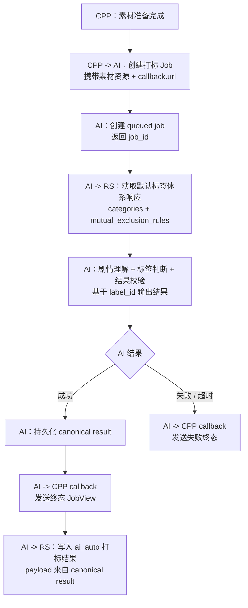

# AI 打标任务流程

本文说明 CPP、AI、RS 在短剧 AI 打标任务中的端到端流转关系。

## 文档职责

本文负责说明打标任务如何创建、执行、查询、callback 和写入 RS。字段级接口见：

- [CPP服务接口.md](CPP服务接口.md)
- [RS ⇄ AI 打标对接接口定义（RS 定稿）.md](RS%20⇄%20AI%20打标对接接口定义（RS%20定稿）.md)

## 主流程

```text
CPP 准备素材
  -> CPP 创建 AI 打标 Job
  -> AI 从 RS 获取默认标签体系响应
  -> AI 执行剧情理解和标签判断
  -> AI 持久化 canonical result
  -> AI callback CPP
  -> AI 写入 RS
```

CPP 只传作品素材资源和 callback 地址。标签结构体和互斥标签结构体不由 CPP 提供，而是由 AI 在任务执行时向 RS 获取默认数据。

## 前置条件

CPP 发起打标前至少确认：

| 条件 | 说明 |
| --- | --- |
| 作品主数据可用 | 包括 `t_book_id`、剧名、简介、字幕语言、剧集结构。 |
| 字幕资源可用 | 至少提供 `subtitle_srt`，可通过 `uri` 或 `text` 交付。 |
| 视频资源可追溯 | 视频可作为扩展素材传入；当前 POC 主要依赖字幕。 |
| callback 地址可用 | 如 CPP 需要终态通知，则在创建 job 时传 `callback.url`。 |

CPP 不需要传 `tag_schema_version`。AI 写 RS 时从本次 RS 标签体系响应中派生 `tag_schema_version`。

## 任务类型

| job_type | 场景 | 说明 |
| --- | --- | --- |
| `short_drama.tagging.initial` | 首次打标 | CPP 首次为作品发起 AI 自动打标。 |
| `short_drama.tagging.incremental` | 增量打标 | 作品集数扩充、字幕修正或内容变更后重新打标。 |

`incremental` 不表示只处理新增集数。为避免标签漂移，AI 应尽量基于本次请求提供的全量素材重新判断。

## AI 内部执行

服务化后的 Job 执行计划：

```text
prepare
  校验 CPP 素材，解析 SRT。

load_rs_tag_structs
  从 RS 获取默认标签体系响应。
  校验 label_id 全局唯一、规则引用存在、数量约束合法。

story_overview
  基于作品上下文和字幕生成剧情概览。

tagging
  基于剧情概览、categories 和 mutual_exclusion_rules 生成标签判断。

finalize
  校验标签合法性，生成内部 canonical result 和写 RS payload。
```

AI 打标关注两类外部输入：

```text
CPP material/assets
RS 默认标签体系响应
```

## 终态动作

AI 生成并持久化 canonical result 后，在同一终态阶段执行两个独立发送动作：

```text
AI -> CPP callback
AI -> RS 写入打标结果
```

两者不能互相中转。CPP callback 使用 CPP 创建 job 时传入的 `callback.url`；RS 写入使用 AI 服务内部配置的 RS 地址。

当前顺序是：AI 先把 job 标记为 `succeeded` 并向 CPP callback 终态，再从同一份 canonical result 派生兼容格式 payload 写入 RS。RS 写入 payload 由专用 adapter 拼接，不把 `status/msg/tag_schema_version` 等兼容字段混入模型输出流程。

当模型生成的结果可写入 RS，但存在缺失分类、低于数量约束等 `partial_success` 问题时，AI 仍进入 `succeeded` 并写入 RS。`partial_success` 的 `success=false` 信号和原因保存在 AI 内部 canonical result / RS 写入明细中，CPP callback 仍只携带 `result=null` 的终态 `JobView`。

终态动作必须满足：

```text
同一个 job_id
RS 写入 payload 来自同一份内部 canonical result
CPP callback 只携带终态 JobView，JobView.result 固定为 null
```

模型推理、素材校验或标签校验失败时不写入 RS，只 callback CPP 失败结果。

## Mermaid



## 查询与 callback

CPP 始终可以通过 `GET /api/v1/ai-jobs/jobs/{job_id}` 查询状态。Callback 是终态通知，不替代轮询能力。

RS 标签翻译任务不使用 callback。RS 创建翻译 job 后，只通过轮询获取结果。
