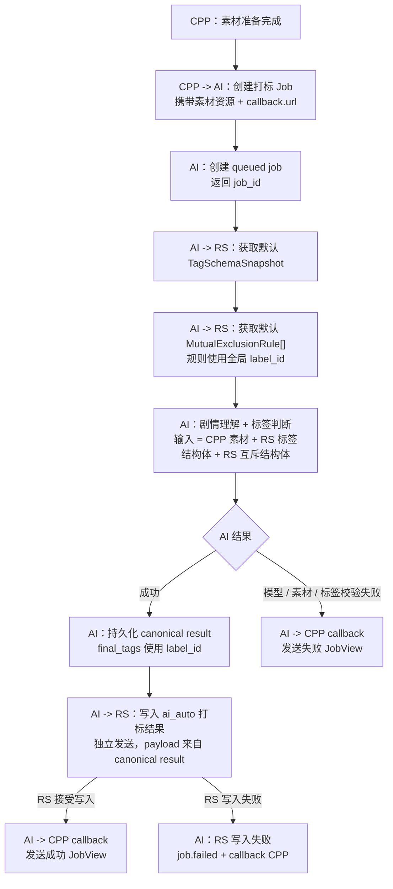

# AI 打标流程图 - Mermaid 版

本文用 Mermaid 表达 CPP、AI、RS 的短剧 AI 打标主流程。文字说明以 [AI打标任务流程.md](AI打标任务流程.md) 为准。

## 关键约束

- CPP 不传标签结构体、互斥结构体或 `tag_schema_version`。
- RS 提供默认标签数据。
- 每个标签必须有全局唯一 `label_id`。
- 互斥规则必须使用 `label_id` / `exclude_label_ids`。
- AI callback CPP 和写 RS 是两个独立发送动作，但都来自同一份 canonical result。
